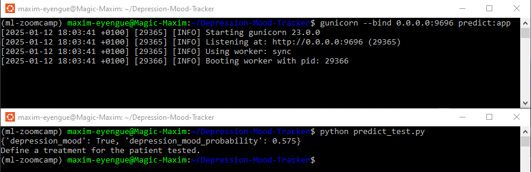
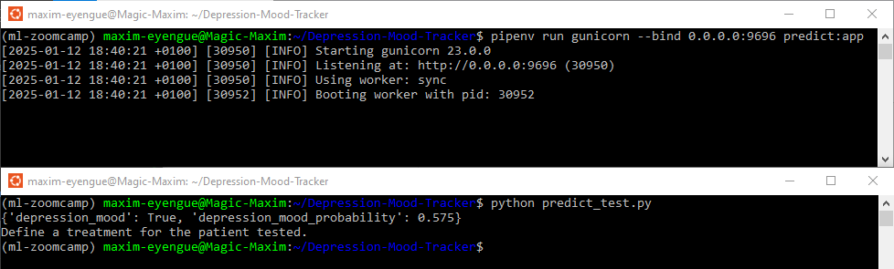

# 🌟 Depression Mood Tracker

This project leverages machine learning to track and analyze patterns of depression using data and predictive modeling techniques. It includes data cleaning, feature engineering, model selection, and deployment as a web service for real-world usability. The application supports local deployment, containerization, and cloud hosting for accessibility and scalability.

---

## 🗂️ Table of Contents
1. [📌 Project Overview](#-project-overview)
2. [📁 Directory Structure](#-directory-structure)
3. [❓ Problem Description](#-problem-description)
4. [⚙️ Installation and Setup](#️-installation-and-setup)
5. [▶️ Running the Project](#️-running-the-project)
6. [🚀 Local Model Deployment](#-local-model-deployment)
7. [🐳 Docker Containerization](#-docker-containerization)
8. [☁️ AWS Elastic Beanstalk Deployment](#️-aws-elastic-beanstalk-deployment)
9. [🧪 Testing the Application](#-testing-the-application)
10. [🤝 Contributing](#-contributing)
11. [📜 License](#-license)

---

## 📌 Project Overview

Depression is a growing mental health challenge globally. This project aims to use machine learning techniques to track mood patterns and provide insights that can aid in early intervention and treatment planning. 

Key features include:
- 🧹 Data preparation and preprocessing.
- 🔍 Exploratory Data Analysis (EDA).
- 🧠 Model training and evaluation.
- 🌐 Web service deployment with Flask.
- 🐳 Docker containerization for easy replication.
- ☁️ Cloud deployment using AWS Elastic Beanstalk.

---

## 📁 Directory Structure

```plaintext
Depression-Mood-Tracker/
│
├── data/                         # Contains datasets used for training
├── capstone_project_01.ipynb     # Jupyter Notebook with detailed steps
├── train.py                      # Script for training and saving the model
├── predict.py                    # Web service for serving the model
├── no_app_predict_test.py        # Test script for direct model testing
├── predict_test.py               # Script for testing the web service
├── predict_test_cloud.py         # Script for testing cloud deployments
├── Pipfile                       # Dependencies for pipenv
├── Pipfile.lock                  # Locked versions of dependencies
├── Dockerfile                    # Docker configuration for containerization
├── LICENSE.txt                   # Project MIT License
└── README.md                     # Project description and instructions
```

---

## ❓ Problem Description

Depression tracking and monitoring are vital for mental health management. This project aims to:
- 🔍 Identify early signs of depression through mood patterns.
- 📊 Provide a data-driven approach for mood tracking.
- 🌍 Deploy an accessible tool for real-world use.

The solution integrates data analysis, predictive modeling, and deployment techniques to create a scalable and reliable application.

---

## ⚙️ Installation and Setup

**Requirements**: Python 3.11, Ubuntu with WSL 2.0 (for Linux-based systems).

### a. Clone the Repository
```bash
git clone https://github.com/maxim-eyengue/Depression-Mood-Tracker.git
cd Depression-Mood-Tracker
```

### b. Install Dependencies
Use `pipenv` for dependency management:
```bash
pip install pipenv
pipenv install flask scikit-learn==1.5.1 gunicorn
```

### c. Create and Activate the Environment
```bash
pipenv shell
```

NB: Alternatively, run commands directly in the pipenv environment using:
```bash
pipenv run `add the command to execute`
```

---

## ▶️ Running the Project

### i. 🏋️‍♂️ Training the Model
Train the model and save it as a binary file:
```bash
python train.py
```

### ii. 🌐 Running the Web Service
Start the Flask application:
```bash
gunicorn --bind 0.0.0.0:9696 predict:app
```

### iii. ✅ Testing the Web Service
Send a test request using the provided test script:
```bash
python predict_test.py
```


---

## 🚀 Local Model Deployment

The model can be deployed locally using Flask and tested with:
```bash
python predict_test.py
```


You can also transition to containerized deployment with Docker.

---

## 🐳 Docker Containerization

### a. Build the Docker Image
Create a Docker image for the project:
```bash
docker build -t depression-mood-tracker .
```

### b. Run the Docker Container
Run the container and map the appropriate port:
```bash
docker run -it --rm -p 9696:9696 depression-mood-tracker
```

### c. Test the Application
Test the service by sending a request:
```bash
python predict_test.py
```


---

## ☁️ AWS Elastic Beanstalk Deployment

### 1. Install AWS Elastic Beanstalk CLI
Install the AWS Elastic Beanstalk CLI in your environment:
```bash
pipenv install awsebcli --dev
```

### 2. Initialize the Application
After activating the environment, initialize the project for Elastic Beanstalk:
```bash
eb init -p "Docker running on 64bit Amazon Linux 2" depression-mood-tracker -r us-east-1
```

### 3. Deploy Locally
Run the application locally for testing:
```bash
eb local run --port 9696
```

### 4. Deploy to the Cloud
Deploy the application to Elastic Beanstalk:
```bash
eb create depression-mood-tracker-env
```

### 5. Terminate the Service
Terminate the environment when done:
```bash
eb terminate depression-mood-tracker-env
```

---

## 🧪 Testing the Application

### i. Direct Model Testing
Test the model without Flask:
```bash
python no_app_predict_test.py
```

### ii. Flask Web Service, Docker, or Local EB
Test using:
```bash
python predict_test.py
```

### iii. Cloud Deployment
Test the application on AWS Elastic Beanstalk:
```bash
python predict_test_cloud.py
```

---

## 🤝 Contributing

Contributions are welcome! To contribute:
- Fork the repository.
- Create a branch for your feature or bug fix.
- Submit a pull request with a detailed explanation of your changes.

---

## 📜 License

This project is licensed under the [MIT License](LICENSE.txt).

---


Let us help you 💕