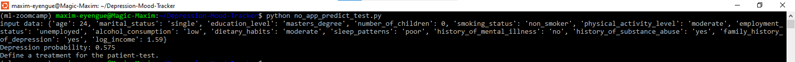
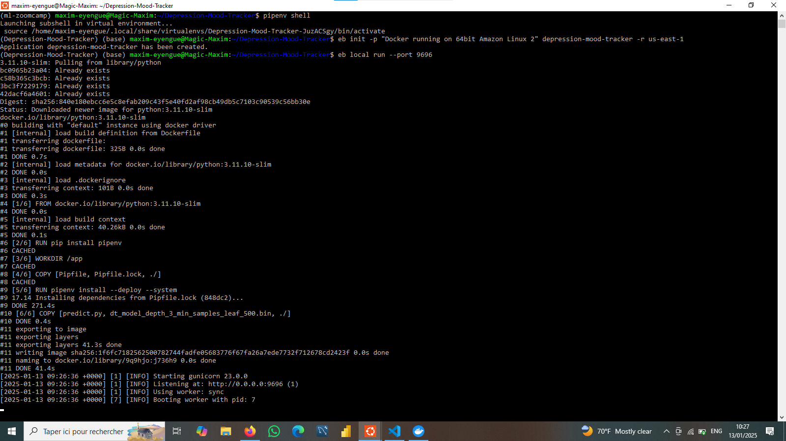
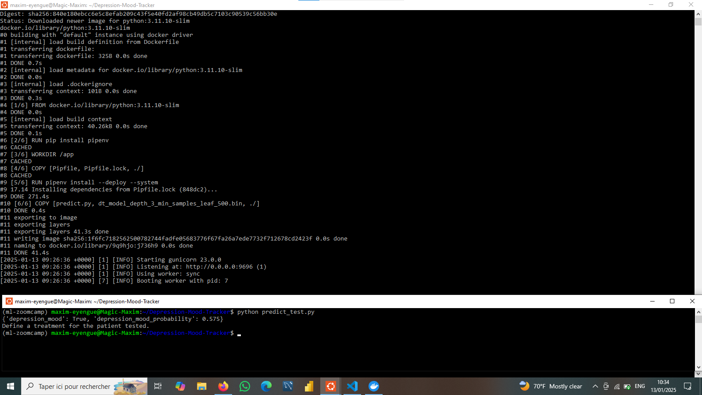
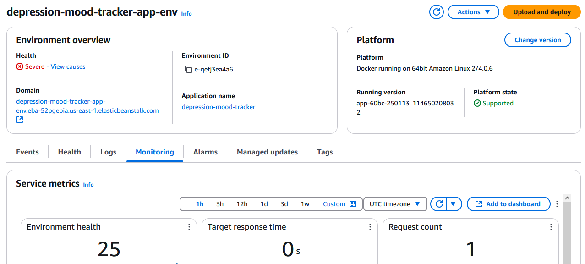
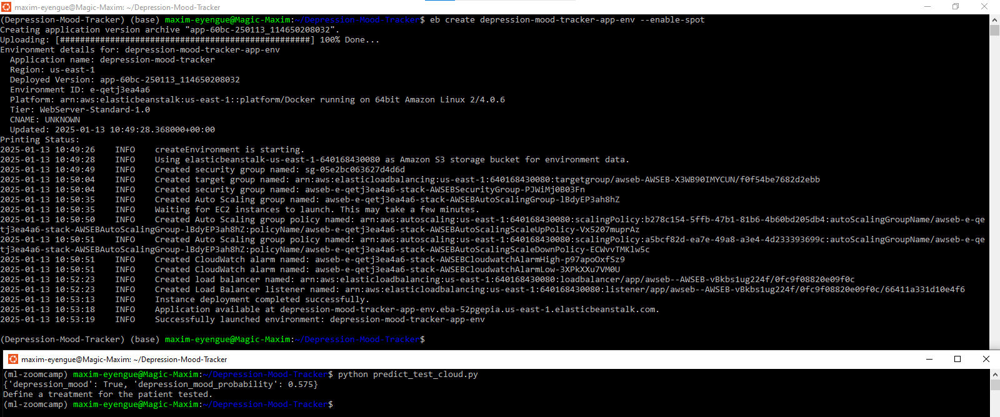

# 🌟 Depression Mood Tracker

This project leverages machine learning to track and analyze patterns of depression using data and predictive modeling techniques. It includes data cleaning, feature engineering, model selection, and deployment as a web service for real-world usability. The application supports local deployment, containerization, and cloud hosting for accessibility and scalability.

---

## 🗂️ Table of Contents
1. [📌 Project Overview](#-project-overview)
2. [📁 Directory Structure](#-directory-structure)
3. [❓ Problem Description](#-problem-description)
4. [⚙️ Installation and Setup](#️-installation-and-setup)
5. [▶️ Running the Project](#️-running-the-project)
6. [🚀 Local Model Deployment](#-local-model-deployment)
7. [🐳 Docker Containerization](#-docker-containerization)
8. [☁️ AWS Elastic Beanstalk Deployment](#️-aws-elastic-beanstalk-deployment)
9. [🧪 Testing the Application](#-testing-the-application)
10. [🤝 Contributing](#-contributing)
11. [📜 License](#-license)

---

## 📌 Project Overview

🧠 **Depression** is a pervasive mental health disorder affecting millions worldwide, with profound implications for individuals and societies. 🌍 [The World Health Organization (WHO) estimates](https://www.who.int/news-room/fact-sheets/detail/depression) that approximately **5% of adults globally** suffer from depression, making it a leading cause of disability. 📉 In **Cameroon**, the situation is equally concerning. A [study published](https://pmc.ncbi.nlm.nih.gov/articles/PMC8280628/) in 2023 found that **8.4% of the population** experienced depression, with a significant portion also reporting high levels of fear related to the COVID-19 pandemic.

💡 These statistics underscore the **urgent need** for effective tools to monitor and address depression. In fact, early detection and personalized intervention can significantly improve outcomes. This project uses machine learning techniques to track, analyze, and predict depression symptoms based on various personal and lifestyle factors. By identifying depression mood states, the system provides valuable insights to support timely intervention, aiding healthcare providers and individuals in managing mental health effectively.

### Key Features:
- 🧹 **Data Preprocessing & Feature Engineering**: Handling missing values, normalizing data, and extracting relevant features for effective analysis.
- 🔍 **Exploratory Data Analysis (EDA)**: Visualizing and identifying key trends and relationships between variables related to mental health.
- 🧠 **Model Training & Evaluation**: Implementing and assessing various machine learning models, with a focus on accuracy as performance metric.
- 🌐 **Web Service Deployment with Flask**: Developing a robust web interface for users to access the mood tracking tool easily.
- 🐳 **Docker Containerization**: Ensuring the project is portable, replicable, and scalable across different environments using Docker.
- ☁️ **Cloud Deployment with AWS Elastic Beanstalk**: Making the model accessible and scalable by hosting it on AWS, ensuring the application is ready for real-world use.

🎯 By integrating these components, the project aims to provide a **scalable** and **reliable application** to support mental health management efforts.

---

## 📁 Directory Structure

```plaintext
Depression-Mood-Tracker/
│
├── data/                         # Contains datasets used for training
├── images/                       # Illustrations and deployment screenshots
├── .elasticbeanstalk/            # Contains the configuration file for the application deployment to AWS Elastic Beanstalk
├── capstone_project_01.ipynb     # Jupyter Notebook with data preparation, analysis, model building and saving
├── train.py                      # Script for training and saving the model
├── predict.py                    # Web service for serving the model
├── no_app_predict_test.py        # Test script for direct model testing
├── predict_test.py               # Script for testing the web service
├── predict_test_cloud.py         # Script for testing the cloud deployment
├── Pipfile                       # Dependencies for pipenv
├── Pipfile.lock                  # Locked versions of dependencies
├── Dockerfile                    # Docker configuration for containerization
├── commands_file.md              # Contains the commands used to deploy the application
├── LICENSE                       # Project MIT License
└── README.md                     # Project description and instructions
```


---

## ❓ **Problem Description**

Depression tracking and monitoring are vital for mental health management. The goal of this project is to **assess depression** in patients by analyzing **personal and lifestyle factors**. This analysis aims to identify key patterns and relationships that can help in understanding and detecting depression, ultimately aiding in prevention and intervention strategies.

More specifically, we will:

- 🔍 Identify early signs of depression through mood patterns.
- 📊 Provide a data-driven approach for mood tracking.
- 🌍 Deploy an accessible tool for real-world use.

As a result, our solution integrates data analysis, predictive modeling, and deployment techniques to create a scalable and reliable application.

#### 📊 **Dataset Overview**

The [Depression Detection Dataset](https://www.kaggle.com/datasets/anthonytherrien/depression-dataset) contains comprehensive information about individuals, including personal, lifestyle, and socio-economic attributes. The dataset is designed to facilitate analysis in the fields of health, lifestyle, and mental health outcomes.

#### **Usage**

This dataset is suitable for:
- 🧠 **Predictive Modeling**: Identifying patterns and predicting mental health outcomes.
- 🔍 **Exploratory Data Analysis (EDA)**: Understanding relationships between various factors.
- 📈 **Clustering**: Grouping similar individuals based on attributes to uncover hidden trends.

**Data Source**: [Kaggle Depression Dataset](https://www.kaggle.com/datasets/anthonytherrien/depression-dataset)

#### 📝 **Feature Description**

The dataset includes the following features:

- **Name**: The full name of the individual [Text].
- **Age**: The age of the individual [years: Numeric].
- **Marital Status**: The marital status of the individual [Single, Married, Divorced, Widowed].
- **Education Level**: The highest level of education attained [High School, Associate Degree, Bachelor's Degree, Master's Degree, PhD].
- **Number of Children**: The number of children the individual has [Numeric].
- **Smoking Status**: Whether the individual is a smoker [Smoker, Former, Non-smoker].
- **Physical Activity Level**: The level of physical activity [Sedentary, Moderate, Active].
- **Employment Status**: The employment status of the individual [Employed, Unemployed].
- **Income**: The annual income of the individual [USD: Numeric].
- **Alcohol Consumption**: The level of alcohol consumption [Low, Moderate, High].
- **Dietary Habits**: The dietary habits of the individual [Healthy, Moderate, Unhealthy].
- **Sleep Patterns**: The quality of sleep [Good, Fair, Poor].
- **History of Mental Illness**: Whether the individual has a history of mental illness [Yes, No].
- **History of Substance Abuse**: Whether the individual has a history of substance abuse [Yes, No].
- **Family History of Depression**: Indicates if there is a family history of depression [Yes, No].
- **Chronic Medical Conditions**: Whether the individual has chronic medical conditions [Yes, No].


#### 🛑 **Alert: Target Variable**

For this project, we considered **chronic medical conditions** as the **target variable**, as it reflects the current health status of patients. Depression, being a chronic illness with long-term impacts on mental and physical health, is inherently linked to this variable, making it crucial for the analysis.

##### 📚 **Why is Depression Considered a Chronic Illness?**

1. **Depression's Long-Term Effects**: Chronic depression often lasts for years, with recurrent episodes and a significant impact on quality of life.  
   *Source*: [National Institute of Mental Health (NIMH)](https://www.nimh.nih.gov/health/publications/depression)

2. **Classification as a Chronic Condition**: Depression is classified as a chronic disease due to its persistence and the need for ongoing treatment.  
   *Source*: [World Health Organization (WHO)](https://www.who.int/news-room/fact-sheets/detail/depression)

3. **Understanding Chronic Depression**: An article discussing the relationship between chronic diseases and depression, highlighting the importance of addressing both for effective treatment.  
   *Source*: [PubMed Central](https://pmc.ncbi.nlm.nih.gov/articles/PMC1071593/)

💡 **NB**: Recognizing depression as a chronic illness is essential for building predictive models and designing effective interventions in mental health care.


---

## **Disclaimer** 🛑  
The [dataset](https://www.kaggle.com/datasets/anthonytherrien/depression-dataset) used in this project is **synthetic** and has been generated rather than collected from real-world sources. ⚠️ Due to the lack of transparency in the data synthesis process, the exact methods and criteria used are **unknown** 🤷‍♂️. As a result, the patterns and relationships within the data may not accurately reflect real-world phenomena 🌍.  

🔍 **Key Points to Note:**  
1️⃣ The results and insights from this dataset should be interpreted with **caution** 🚧.  
2️⃣ These findings are **not reliable** for making real-world decisions or predictions 🚫.  
3️⃣ This project is intended solely for **educational** and **experimental** purposes 🧪📚.  

#### **Supporting Sources** 📚  
Here are some resources explaining the limitations and considerations of synthetic data:  

- 🎲 **The Benefits and Limitations of Generating Synthetic Data** - [Syntheticus](https://syntheticus.ai/blog/the-benefits-and-limitations-of-generating-synthetic-data?utm_source=chatgpt.com)  
- 🩺 **Harnessing the Power of Synthetic Data in Healthcare** - [Nature](https://www.nature.com/articles/s41746-023-00927-3?utm_source=chatgpt.com)  
- ⚖️ **Synthetic Health Data: Real Ethical Promise and Peril** - [PMC](https://pmc.ncbi.nlm.nih.gov/articles/PMC11555762/?utm_source=chatgpt.com)  
- 🔗 **The Pros and Cons of Synthetic Data** - [DATAVERSITY](https://www.dataversity.net/the-pros-and-cons-of-synthetic-data/?utm_source=chatgpt.com)  
- 💡 **The Dangers of Using Synthetic Patient Data to Build Healthcare AI Models** - [Forbes](https://www.forbes.com/councils/forbestechcouncil/2023/05/26/the-dangers-of-using-synthetic-patient-data-to-build-healthcare-ai-models/?utm_source=chatgpt.com)  
- 🧠 **Synthetic Data Generation with Large Language Models: Potential and Limitations** - [arXiv](https://arxiv.org/abs/2310.07849?utm_source=chatgpt.com)  
- 📊 **Reimagining Synthetic Tabular Data Generation Through Data-Centric AI** - [arXiv](https://arxiv.org/abs/2310.16981?utm_source=chatgpt.com)  

---

## ⚙️ Installation and Setup

**Requirements**: Python 3.11, Ubuntu with WSL 2.0 (for Linux-based systems).

### a. Clone the Repository
```bash
git clone https://github.com/maxim-eyengue/Depression-Mood-Tracker.git
cd Depression-Mood-Tracker
```

### b. Install Dependencies
Use `pipenv` for dependency management:
```bash
pip install pipenv
pipenv install flask scikit-learn==1.5.1 gunicorn
```

### c. Create and Activate the Environment
```bash
pipenv shell
```

NB: Alternatively, run commands directly in the pipenv environment using:
```bash
pipenv run `add the command to execute`
```

---

## ▶️ Running the Project

### i. 🏋️‍♂️ Training the Model
Train the model and save it as a binary file:
```bash
python train.py
```
You can now test the model using a script:
```bash
python no_app_predict_test.py
```


### ii. 🌐 Running the Web Service
Start the Flask application:
```bash
gunicorn --bind 0.0.0.0:9696 predict:app
```

### iii. ✅ Testing the Web Service
Send a test request using the provided test script:
```bash
python predict_test.py
```


---

## 🚀 Local Model Deployment

The model can be deployed locally using Flask and tested with:
```bash
python predict_test.py
```


You can also transition to containerized deployment with Docker.

---

## 🐳 Docker Containerization

### a. Build the Docker Image
Create a Docker image for the project:
```bash
docker build -t depression-mood-tracker .
```

### b. Run the Docker Container
Run the container and map the appropriate port:
```bash
docker run -it --rm -p 9696:9696 depression-mood-tracker
```

### c. Test the Application
Test the service by sending a request:
```bash
python predict_test.py
```


---

## ☁️ AWS Elastic Beanstalk Deployment

### 1. Install AWS Elastic Beanstalk CLI
Install the AWS Elastic Beanstalk CLI in your environment:
```bash
pipenv install awsebcli --dev
```

### 2. Initialize the Application
After activating the environment with `pipenv shell`, initialize the project for Elastic Beanstalk:
```bash
eb init -p "Docker running on 64bit Amazon Linux 2" depression-mood-tracker -r us-east-1
```
Provide your AWS credentials when prompted. These can be generated from the AWS IAM service.

NB: You can follow [Alexey's tutorial](https://mlbookcamp.com/article/aws) to create an account on AWS.

### 3. Deploy Locally
Run the application locally for testing:
```bash
eb local run --port 9696
```


After deploying the model locally with Elastic Beanstalk, you can test the service by sending a request:
```bash
python predict_test.py
```


### 4. Deploy to the Cloud
Deploy the application to Elastic Beanstalk:
```bash
eb create depression-mood-tracker-app-env --enable-spot
```


The application has been deployed to the cloud with an [Elastic Beanstalk host](depression-mood-tracker-app-env.eba-52pgepia.us-east-1.elasticbeanstalk.com). To test this cloud deployment, we sent a request to the [service URL address](http://depression-mood-tracker-app-env.eba-52pgepia.us-east-1.elasticbeanstalk.com/predict):
```bash
python predict_test_cloud.py
```


### 5. Terminate the Service
Terminate the environment when done:
```bash
eb terminate depression-mood-tracker-app-env
```

---

## 🧪 Testing the Application

It is important to note that we used different test scripts to test our application, during all the deployment process.

### i. Direct Model Testing
Test the model without Flask:
```bash
python no_app_predict_test.py
```

### ii. Flask Web Service, Docker, or Local EB
Test using:
```bash
python predict_test.py
```

### iii. Cloud Deployment
Test the application on AWS Elastic Beanstalk:
```bash
python predict_test_cloud.py
```

---

## 🤝 Contributing

Contributions are welcome! To contribute:
- Fork the repository.
- Create a branch for your feature or bug fix.
- Submit a pull request with a detailed explanation of your changes.

---

## 📜 License

This project is licensed under the [MIT License](LICENSE.txt).

---


Allow us to help you 💕